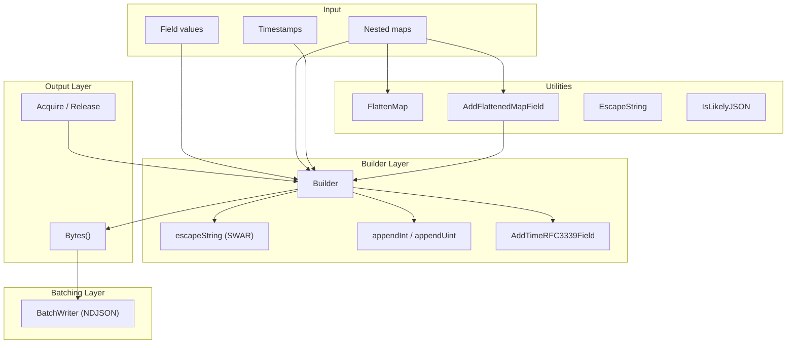

# go-jsonfast

> A zero-allocation JSON builder for Go, optimized for fixed schemas and high-throughput pipelines.

[](https://golang.org)
[](https://pkg.go.dev/github.com/ubyte-source/go-jsonfast)
[](https://opensource.org/licenses/MIT)
[](go.mod)

## 🏗 Architecture Overview



## ✨ Key Features

- 🚀 **Zero Allocations** — all methods operate on a reusable `[]byte` buffer — no copies on the hot path
- 🧱 **Pure Go** — no external dependencies, no code generation, no cgo
- 📋 **RFC 8259 Compliant** — JSON string escaping with invalid UTF-8 → U+FFFD replacement
- ⚡ **SWAR String Scanning** — word-at-a-time (8 bytes) fast path for safe ASCII runs
- 🕐 **Hand-Written RFC 3339** — time formatting without `time.Format` allocations
- 📊 **Sorted Map Output** — deterministic JSON for caching and deduplication
- 📦 **NDJSON BatchWriter** — batch multiple records for message brokers
- 🗺️ **Map Flattening** — nested `map[string]map[string]string` to dot-notation keys
- 🧬 **Fuzz-Tested** — continuous Go native fuzzing for `escapeString`

## 🚀 Quick Start

### 📦 Installation

```bash
go get github.com/ubyte-source/go-jsonfast
```

Requires **Go 1.25+**.

### 💡 Basic Usage

```go
package main

import (
    "fmt"
    "time"

    "github.com/ubyte-source/go-jsonfast"
)

func main() {
    b := jsonfast.Acquire()
    b.BeginObject()
    b.AddStringField("message", "hello world")
    b.AddIntField("severity", 3)
    b.AddTimeRFC3339Field("timestamp", time.Now())
    b.EndObject()
    data := b.Bytes() // no allocation
    fmt.Println(string(data))
    jsonfast.Release(b) // return to pool
}
```

### 🔁 Reuse Without Allocation

```go
b := jsonfast.New(512)

b.BeginObject()
b.AddStringField("k", "v1")
b.EndObject()
process(b.Bytes())

b.Reset() // ready for reuse, no allocation
b.BeginObject()
b.AddStringField("k", "v2")
b.EndObject()
process(b.Bytes())
```

### 📦 NDJSON Batching

```go
bw := jsonfast.NewBatchWriter(4096)
b := jsonfast.Acquire()

for _, msg := range messages {
    b.BeginObject()
    b.AddStringField("msg", msg)
    b.EndObject()
    bw.Append(b.Bytes())
    b.Reset()
}

jsonfast.Release(b)
payload := bw.Bytes() // {"msg":"..."}\n{"msg":"..."}\n...
bw.Reset()
```

### � Pre-computed Field Keys

For static field names known at init time, use `FieldKey` to eliminate
per-call quoting overhead (~7% faster):

```go
var (
    keyMessage  = jsonfast.NewFieldKey("message")
    keySeverity = jsonfast.NewFieldKey("severity")
)

b := jsonfast.Acquire()
b.BeginObject()
b.AddStringFieldKey(keyMessage, "hello world")
b.AddIntFieldKey(keySeverity, 3)
b.EndObject()
jsonfast.Release(b)
```

### �🗺️ Map Flattening

```go
nested := map[string]map[string]string{
    "sd@123": {"key1": "val1", "key2": "val2"},
}
flat := jsonfast.FlattenMap(nested, nil)
// flat = {"sd@123.key1": "val1", "sd@123.key2": "val2"}
```

## 📖 API Reference

See the [package documentation](https://pkg.go.dev/github.com/ubyte-source/go-jsonfast) for the full API.

### Builder

| Function | Description |
|----------|-------------|
| `New(capacity int) *Builder` | Create a new builder with initial capacity |
| `Acquire() *Builder` | Get a builder from the pool |
| `Release(*Builder)` | Return a builder to the pool |
| `(*Builder).Reset()` | Clear for reuse without allocation |
| `(*Builder).Bytes() []byte` | Get the underlying buffer |
| `(*Builder).Len() int` | Current buffer length |

### Field Methods

| Method | Description |
|--------|-------------|
| `BeginObject()` | Start a JSON object `{` |
| `EndObject()` | End a JSON object `}` |
| `AddStringField(name, value string)` | Add `"name":"value"` with escaping |
| `AddIntField(name string, v int)` | Add `"name":123` |
| `AddUint8Field(name string, v uint8)` | Add `"name":255` |
| `AddUint16Field(name string, v uint16)` | Add `"name":65535` |
| `AddBoolField(name string, v bool)` | Add `"name":true/false` |
| `AddNullField(name string)` | Add `"name":null` |
| `AddTimeRFC3339Field(name string, t time.Time)` | Add `"name":"2024-01-15T12:30:45Z"` |
| `AddRawJSONField(name string, rawJSON []byte)` | Add `"name":<raw>` (no escaping) |
| `AddRawJSONFieldString(name, rawJSON string)` | Same, avoids `[]byte` allocation |
| `AddNestedStringMapField(name string, m map[string]map[string]string)` | Add nested map as JSON object |
| `AddStringMapObject(m map[string]string, rawJSONKey string)` | Write map as JSON object |
| `AddFlattenedMapField(m map[string]map[string]string)` | Write flattened dot-notation fields |

### Pre-computed FieldKey Methods

| Function | Description |
|----------|-------------|
| `NewFieldKey(name string) FieldKey` | Create a pre-computed field key (call at init time) |
| `AddStringFieldKey(k FieldKey, value string)` | Add `"name":"value"` using pre-computed key |
| `AddIntFieldKey(k FieldKey, v int)` | Add `"name":123` using pre-computed key |
| `AddInt64FieldKey(k FieldKey, v int64)` | Add `"name":123` using pre-computed key |
| `AddUint64FieldKey(k FieldKey, v uint64)` | Add `"name":123` using pre-computed key |
| `AddBoolFieldKey(k FieldKey, v bool)` | Add `"name":true/false` using pre-computed key |
| `AddFloat64FieldKey(k FieldKey, v float64)` | Add `"name":3.14` using pre-computed key |
| `AddTimeRFC3339FieldKey(k FieldKey, t time.Time)` | Add `"name":"..."` using pre-computed key |
| `AddRawJSONFieldKey(k FieldKey, rawJSON []byte)` | Add `"name":<raw>` using pre-computed key |
| `AddNullFieldKey(k FieldKey)` | Add `"name":null` using pre-computed key |

### Raw Append

| Method | Description |
|--------|-------------|
| `AppendRaw([]byte)` | Append raw bytes (no escaping) |
| `AppendRawString(string)` | Append raw string (no escaping) |
| `AppendEscapedString(string)` | Append with JSON escaping (zero-alloc) |

### Scanner (scan.go)

| Function | Description |
|----------|-------------|
| `IterateFields(data []byte, fn func(key, value []byte) bool) bool` | Iterate top-level key-value pairs |
| `IterateFieldsString(s string, fn func(key, value []byte) bool) bool` | Same, accepts string input |
| `FindField(data []byte, key string) ([]byte, bool)` | Find a field value by key name |
| `FlattenObject(b *Builder, data []byte) bool` | Recursively flatten nested JSON into Builder |
| `SkipWS(data []byte, i int) int` | Skip whitespace |
| `SkipValueAt(data []byte, i int) (int, bool)` | Skip a complete JSON value |
| `SkipStringAt(data []byte, i int) (int, bool)` | Skip a JSON string (SWAR-accelerated) |
| `SkipBracedAt(data []byte, i int, opener, closer byte) (int, bool)` | Skip balanced delimiters |

### Utilities

| Function | Description |
|----------|-------------|
| `EscapeString(string) string` | Escape JSON special characters (zero-alloc if no escaping needed) |
| `IsLikelyJSON(string) bool` | Quick check if string looks like JSON object/array |
| `FlattenMap(m, dst map[string]string) map[string]string` | Flatten nested map to dot-notation |

### BatchWriter (NDJSON)

| Function | Description |
|----------|-------------|
| `NewBatchWriter(capacity int) *BatchWriter` | Create a new batch writer |
| `(*BatchWriter).Append([]byte)` | Add a JSON record + newline |
| `(*BatchWriter).AppendString(string)` | Add a JSON record + newline (string) |
| `(*BatchWriter).Bytes() []byte` | Get the NDJSON payload |
| `(*BatchWriter).Len() int` | Current byte length |
| `(*BatchWriter).Count() int` | Number of records |
| `(*BatchWriter).Reset()` | Clear for reuse |

## ⚡ Benchmarks

Run with:
```bash
make bench
```

Target: **0 allocs/op** on all builder benchmarks, **<170 ns/op** for a full syslog object.

```
BenchmarkBuilder_FullSyslogObject-32           34748235     171 ns/op     0 B/op    0 allocs/op
BenchmarkBuilder_FullSyslogObject_FieldKey-32  37712958     161 ns/op     0 B/op    0 allocs/op
BenchmarkBuilder_AddStringField-32             78449582      46 ns/op     0 B/op    0 allocs/op
BenchmarkBuilder_EscapeString_PureASCII-32    100000000      33 ns/op     0 B/op    0 allocs/op
BenchmarkBuilder_AcquireRelease-32            100000000      31 ns/op     0 B/op    0 allocs/op
```

## 🧪 Testing

```bash
make test        # All tests with race detector
make bench       # Benchmarks with memory profiling
make fuzz        # Native Go fuzzing (30s)
make cover       # Coverage report
make lint        # golangci-lint (25 linters, ultra-strict)
```

## 🛡️ Security

The builder enforces bounds to prevent resource exhaustion:

| Parameter | Limit | Constant |
|-----------|-------|----------|
| Maximum pooled buffer size | 256 KiB | `1<<18` |
| Maximum flatten depth | 64 levels | `maxFlattenDepth` |

For security policy and vulnerability reporting, see [SECURITY.md](SECURITY.md).

## 🧠 Design Principles

1. **Zero-alloc is a constraint, not a goal.** It guides every design decision — enforced by benchmarks.
2. **Fixed schemas only.** Not a general-purpose JSON encoder — tailored for known field sets.
3. **Deterministic output.** Sorted keys for caching and deduplication.
4. **No dependencies.** Pure Go, no external libraries, no cgo.
5. **The buffer is the API.** Everything writes directly into `[]byte` — no intermediate representations.

## 📁 Project Structure

```
go-jsonfast/
├── jsonfast.go         # Builder: zero-alloc JSON builder with pool, escaping, field methods
├── scan.go             # JSON scanner: IterateFields, FindField, FlattenObject, Skip*
├── swar.go             # SWAR constants and detect functions for word-at-a-time scanning
├── flatten.go          # FlattenMap, AddFlattenedMapField: nested map flattening
├── ndjson.go           # BatchWriter: NDJSON record batching
├── doc.go              # Package documentation
├── .golangci.yml       # Ultra-strict linter config (25 linters)
├── Makefile            # Build, test, bench, fuzz, lint
├── CONTRIBUTING.md     # Contribution guidelines
├── SECURITY.md         # Security policy
└── LICENSE             # MIT
```

## 🤝 Contributing

Contributions are welcome. Please fork the repository, create a feature branch, and submit a pull request.

For contribution guidelines, see [CONTRIBUTING.md](CONTRIBUTING.md).

---

## 🔖 Versioning

We use [SemVer](https://semver.org/) for versioning. For available versions, see the [tags on this repository](https://github.com/ubyte-source/go-jsonfast/tags).

---

## 👤 Authors

- **Paolo Fabris** — _Initial work_ — [ubyte.it](https://ubyte.it/)

See also the list of [contributors](https://github.com/ubyte-source/go-jsonfast/contributors) who participated in this project.

## 📄 License

This project is licensed under the MIT License — see the [LICENSE](LICENSE) file for details.

---

## ☕ Support This Project

If go-jsonfast has been useful for your high-throughput pipelines, consider supporting its development:

[](https://coff.ee/ubyte)

---

**Star this repository if you find it useful.**

For questions, issues, or contributions, visit our [GitHub repository](https://github.com/ubyte-source/go-jsonfast).
